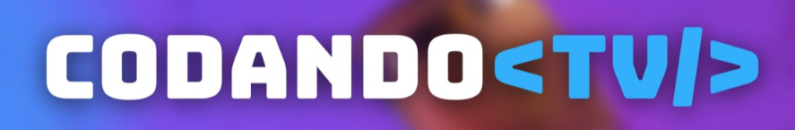

# StreamPlayerApp
<h3 align="center"> 
  

</h3> 

## 🇧🇷 Versão em Português ↙️

🇧🇷 Se você fala português do Brasil, olhe [aqui](./README_pt-br.md) 🇧🇷

## 🎯 About

StreamPlayerApp is an open source project based on the Netflix app, all of the features are being implemented by members of our CodandoTV community. The objective is to provide a learning and practical programming experience, serving as a mentoring platform. These are the technologies we are using here:

**Flow, Compose, Koin, NavigationCompose, Arquitetura MVVM com clean architecture entre outras ( ainda será separado um link para isso)**

## 🏋️‍♀️ Goal
This project was initiated with the purpose of providing a hands-on and collaborative learning opportunity for the community. Through it, participants can improve their skills in Android development, Kotlin, clean architecture and teamwork.

## 💬 Communication
We have a specific channel called [#projeto-netflix](https://discord.com/channels/843114243859546142/1101921493010616351)) in our [Discord](https://discord.gg/fZMDmjKmju) server to talk about the project.

------------------------------------------

### 🚨 If you arrived here, and you are not subscribed in our YouTube channel, this is a great moment to do that 🙏. 

Follow our playlist of videos called [Projeto Netflix](https://www.youtube.com/playlist?list=PL-7tME9TKyA4At5ze9i8-w_trk7nXMGRj), all of the material was produced using this repository.

------------------------------------------

## ✨ How to contribute?

If you wish to contribute to this project, chose the best path that suits you:

1. If you want to learn something or want to explore the mentoring process or you have questions about what you should do.
    - Talk to someone in our [Discord](https://discord.gg/fZMDmjKmju), you can use the channel called  [#projeto-netflix](https://discord.com/channels/843114243859546142/1101921493010616351)(Rods, Gabriel Moro or Carlos Vaccari) to help you.
    - The mentoring will be shaped together with we do not know how it will be, so be patient and let's learn together 😊!
    - The main goal is to use the Discord as main communication tool.
    
2. If you want to help mentoring people:
    - Talk to someone in the Discord, use the channel `#projeto-netflix`, you can start from there helping people there.
    - Reach us in the [Discord](https://discord.gg/fZMDmjKmju) server, you can reach out Rods, Moro or Carlos Vaccari.

3. If you are just trying to find an excuse to code, do some fun or why do not you find something fun to do!
    - Follow the [steps](https://github.com/CodandoTV/StreamPlayerApp/blob/master/CONTRIBUTOR_PROJECT.md) and welcome!

4. If there is a lack of something that is not being mapped, there is an issue and a failure with our supporting members;

5. If you want to record videos to be published in the CodandoTV channel showing what you did, you can:
    - Talk to Rods! [Discord](https://discord.gg/fZMDmjKmju) / [LinkedIn](https://www.linkedin.com/in/rviannaoliveira/)

All contributions conditions are available here in the  [Step-by-step to be a contributor](https://github.com/CodandoTV/StreamPlayerApp/blob/master/CONTRIBUTOR_PROJECT.md)

---

## 🗺️ How to use the WIKI (7th tab in our git project)

I hope our wiki becomes richer and richer, so it will be a continuous process. These will be listed, our technologies motivators and more something that we find relevant.

If you realize that something relevant is missing here, please vote and post a PR for the wiki as well!
[Step-by-step](https://github.com/CodandoTV/StreamPlayerApp/blob/master/CONTRIBUTOR_WIKI.md)

--- 

## 🎤 How to use the Discussions option (4th tab in our git project)

It may be that there are non-discord threads that interrupt and sometimes communicate like in any company there is a mistake, imagine a project that we do in our spared time.

We have a section called `discussions`, this is hosted in our repository, so we keep history. If you want to see an example of [Discussion](https://github.com/CodandoTV/StreamPlayerApp/discussions/48), we can create long threads there, something like `reddit`. Let's see if this approach works for us.

---

## 👀 Do you wanna see our app?

---

### If you arrived here, please subscribe in our YouTube channel 😛 [Codandotv](https://bit.ly/3Ob3yPH)

## Contributors

This project exists thanks to all the people who contribute.

License
-------

    Copyright 2023 Rodrigo Vianna

    Licensed under the Apache License, Version 2.0 (the "License");
    you may not use this file except in compliance with the License.
    You may obtain a copy of the License at

    http://www.apache.org/licenses/LICENSE-2.0

    Unless required by applicable law or agreed to in writing, software
    distributed under the License is distributed on an "AS IS" BASIS,
    WITHOUT WARRANTIES OR CONDITIONS OF ANY KIND, either express or implied.
    See the License for the specific language governing permissions and
    limitations under the License.

 
